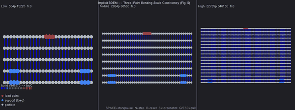

[日本語](README.ja.md)

# ibdem — Implicit BDEM Three-Point Bending (Fig. 5 Reproduction)

<p align="center">
  
</p>

A C++ reproduction of the three-point bending scale-consistency experiment from:

> **"Implicit Bonded Discrete Element Method with Manifold Optimization"**
> ACM Transactions on Graphics (2023), DOI: 10.1145/3592427
> (Paper ID: 3711852)

Three beam scales (Low / Middle / High) are simulated simultaneously.
All three scales fracture at approximately the same load level (frame ~23–25), matching Table 2 and Fig. 5 of the paper.

Bonds are colored by stress level: **blue** (low) → **green** → **red** (near fracture, σ ≈ τ_c).

---

## Build

### Windows

Install [vcpkg](https://github.com/microsoft/vcpkg) and Visual Studio 2022, then:

```powershell
vcpkg install freeglut:x64-windows glm:x64-windows
vcpkg integrate install

mkdir build
cd build
cmake ../ -G "Visual Studio 17" -A x64 -DCMAKE_TOOLCHAIN_FILE="$env:VCPKG_INSTALLATION_ROOT/scripts/buildsystems/vcpkg.cmake"
cmake --build . --config Release
```

### macOS

```bash
brew install glm

mkdir build && cd build
cmake ../ -G Xcode
cmake --build . --config Release
```

### Ubuntu / Debian

```bash
sudo apt-get install \
  libxi-dev libgl1-mesa-dev libglu1-mesa-dev mesa-common-dev \
  libxrandr-dev libxxf86vm-dev freeglut3-dev libglm-dev

mkdir build && cd build
cmake ../ -DCMAKE_BUILD_TYPE=Release
cmake --build .
```

---

## Run

### GUI mode (default)

```
./bin/ibdem
```

Opens a 1200×450 window with three viewports side-by-side (Low / Middle / High).
The simulation **starts automatically**. Bond colors shift from blue to red as stress builds up; broken bonds disappear around frame 24.

**Controls:**

| Key | Action |
|-----|--------|
| `SPACE` | Pause / resume |
| `N` | Advance one frame (while paused) |
| `R` | Reset all scales to initial state |
| `S` | Save a BMP screenshot (`capture_frNNNN.bmp`) |
| `Q` / `ESC` | Quit |

### Headless mode

Runs without a window and prints the fracture frame for each scale:

```
./bin/ibdem -headless [N]
```

Default N = 60. Expected output:

```
Scale Low     : fracture at frame 24  (target ~23)
Scale Middle  : fracture at frame 24  (target ~25)
Scale High    : fracture at frame 24  (target ~25)
```

### Capture mode

Renders every frame and saves it as a BMP file, then exits automatically:

```
./bin/ibdem -capture [N]
```

Default N = 40. Produces `capture_fr0001.bmp` … `capture_frNNNN.bmp` in the current directory.
Useful for verifying the animation offline without interacting with the window.
Note: High scale (~22K particles) takes several seconds per frame; capturing 40 frames takes a few minutes.

---

## Parameters

All parameters match Table 2 of the paper.

| Parameter | Value |
|-----------|-------|
| Beam dimensions | L = 1.0 m, H = 0.15 m, W = 0.12 m |
| Young's modulus E | 1 × 10⁷ Pa |
| Poisson's ratio ν | 0.3 |
| Fracture threshold τ_c | 3 × 10⁴ Pa |
| Load velocity | 0.069 m/frame |
| Particle radius r — Low | 0.018 m (~504 particles) |
| Particle radius r — Middle | 0.011 m (~2024 particles) |
| Particle radius r — High | 0.005 m (~22725 particles) |

---

## Project Structure

```
ibdem/
├── src/
│   ├── main.cpp          # GLUT window, rendering, keyboard input, run modes
│   ├── Simulation.cpp/h  # Implicit solver (PCG + manifold descent)
│   ├── BondForce.cpp/h   # Bond stress and fracture criterion
│   ├── HexPacking.cpp/h  # Hexagonal close-packing particle generator
│   ├── Particle.h        # Particle state (position, orientation, flags)
│   └── Bond.h            # Bond geometry and cached stress
├── .github/workflows/    # CI: windows.yml, macos.yml, ubuntu.yml
├── CMakeLists.txt
├── CMakePresets.json
└── README.md
```
